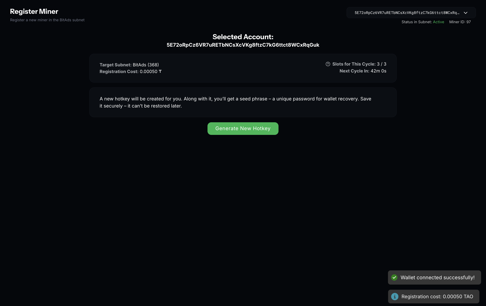
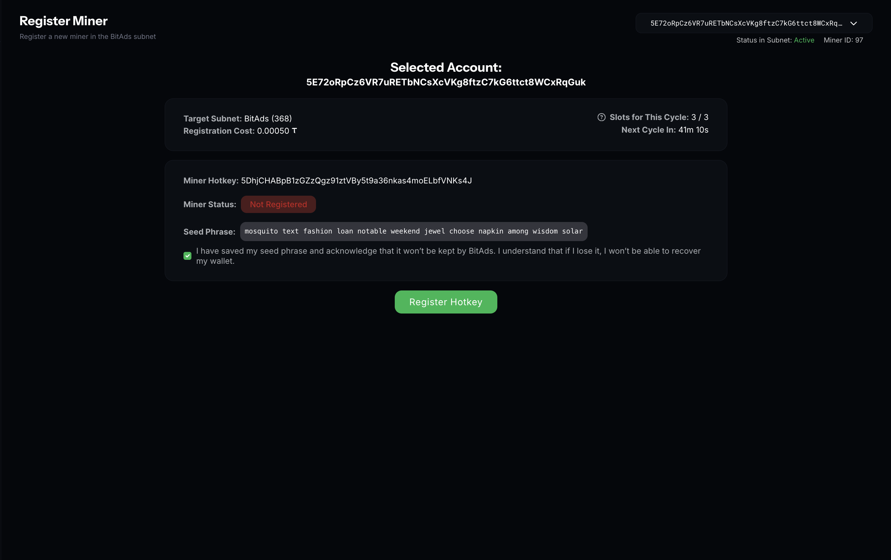
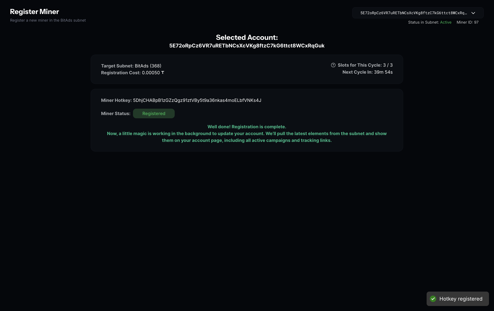

# Mining Guide

This guide is for miners who want to participate in the BitAds V3 subnet and earn rewards based on their performance.

## What is Mining?

Mining in BitAds V3 involves providing ad campaign services on the Bittensor network. Miners earn rewards based on their performance metrics:

- **Sales**: Number of successful ad campaign sales
- **Revenue**: Total net revenue generated in USD (after subtracting refunds)
- **Refunds**: Number of refund orders (lower is better)

## Prerequisites

### Register Your Hotkey on the Subnet

You can register your hotkey either via the BitAds website (recommended) or directly with the Bittensor CLI.

#### Option 1 — Via BitAds website

- **Connect your wallet** on the BitAds website and open the **Register Miner** modal.
- Review the header info: **Selected Account**, **Target Subnet**, **Slots for This Cycle**, **Registration Cost**, **Next Cycle In**.
- 
- **Generate New Hotkey**: the system generates a hotkey and seed phrase. Save the seed phrase and confirm the checkbox, then click **Register Hotkey**.
- Sign the registration transaction in a **Polkadot.js-supported wallet**.
- Wait for the status to reach **“Registration completed”**, then the modal shows a short confirmation with your account, subnet, miner hotkey, and status.
- 
- 

#### Option 2 — CLI (advanced)

You can also register directly via the Bittensor CLI:

**For Mainnet (finney)**:
```sh
btcli subnet register --netuid 16
```

**For Testnet (test)**:
```sh
btcli subnet register --netuid 368
```

Make sure the wallet paying the fee has enough TAO to cover the registration cost.

## How Scoring Works

Your score is calculated by validators using the following algorithm:

### Step 1: Refund Rate
```
refund_rate = min(1, refund_orders / max(1, sales))
```

### Step 2: Sales Normalization
```
sales_norm = min(1, sqrt(sales) / max(sqrt(p95_sales), eps))
```
Normalized against the 95th percentile of all miners.

### Step 3: Revenue Normalization
```
rev_norm = min(1, ln(1 + revenue) / max(ln(1 + p95_revenue), eps))
```
Normalized against the 95th percentile of all miners.

### Step 4: Base Score
```
base = 0.40 * sales_norm + 0.60 * rev_norm
```
Weighted combination: 40% sales, 60% revenue.

### Step 5: Final Score
```
score = (1 - refund_rate) * base
```
Applies refund multiplier.

### Step 6: Soft Cap (if enabled)
If `sales < 3`:
```
score = score * 0.30
```

## How to Maximize Your Miner Score

Your miner score reflects the **real economic value** you bring to the network.  
It is based on **attributed sales**, **net revenue**, and **refunds** – not on clicks or impressions.

### 1. Drive Attributed Sales

- Bring **real, purchase-ready traffic**
- Focus on users who are likely to complete a purchase
- Make sure traffic is properly **attributed to your miner ID**
- Only sales linked to your clicks and confirmed via the system count toward your score  
**Conversions matter. Raw traffic volume does not.**

### 2. Maximize Net Revenue

- Your score is driven by **net revenue**, not just the number of orders
- Prioritize campaigns with **strong buying intent**
- Optimize traffic quality to increase **average order value**
- **Net revenue = total sales minus refunds**  
Higher net revenue directly increases your **emission weight**.

### 3. Minimize Refund Impact

- Refunds reduce your **contribution score**
- Avoid misleading creatives or low-intent traffic
- Send users who understand the offer and are ready to buy
- Refunds directly reduce net revenue and negatively affect your score  
**Clean sales outperform high volume with refunds.**

### 4. Stay Consistent

- Long-term performance matters
- Stable, predictable results are rewarded over time
- Short-term spikes with poor quality may reduce trust signals
- Sustainable revenue beats one-off wins  
Consistency builds miner weight.

### In Short

Your miner score increases when you **consistently deliver clean, attributed sales** with **strong net revenue** and **low refunds**.

## Understanding Your Performance

### P95 Percentiles

Your performance is normalized against the 95th percentile of all miners:
- If you're at P95, your normalized score is 1.0
- If you're below P95, your normalized score is proportional
- P95 values are computed automatically from all miner statistics

### Soft Cap

Miners with sales < 3 receive a 0.30 multiplier on their score. This encourages consistent performance and discourages inactive miners.

### Refund Impact

High refund rates significantly reduce your score:
- Refund rate = refunds / sales
- Final score = base score × (1 - refund rate)
- Example: 20% refund rate reduces your score by 20%

## Performance Metrics

### Sales Count

The number of successful ad campaign sales you've completed in the rolling window (typically 30 days).

### Revenue in USD

The total **net revenue** generated from your ad campaign services, measured in USD (after subtracting refunds).

### Refund Orders

The number of refund orders processed. Lower is better.

## Monitoring Your Performance

### Check Your Stats

Monitor your performance metrics regularly:
- Track sales count over time
- Monitor revenue trends
- Keep refund rate as low as possible

### Track Your Score

Your score is computed by validators and submitted to the Bittensor network. You can check your weight in the metagraph to see your relative performance.

### Weight Distribution

Weights are distributed based on scores:
- Higher scores → Higher weights → More rewards
- Weights are normalized across all miners
- Burn percentage goes to UID 0 (subnet owner)

## Best Practices

### Consistency

- Maintain steady performance over time
- Avoid large fluctuations in sales or revenue
- Build a sustainable business model

### Quality

- Focus on delivering value to customers
- Prioritize quality over quantity
- Build a strong reputation

### Customer Service

- Minimize refunds through excellent service
- Respond quickly to customer issues
- Set clear expectations upfront

### Monitoring

- Track your metrics regularly
- Identify trends and patterns
- Adjust your strategy based on performance

## Common Pitfalls

### Low Sales Volume

- Problem: Sales < 3 triggers soft cap (0.30 multiplier)
- Solution: Focus on increasing sales volume consistently

### High Refund Rate

- Problem: High refunds significantly reduce score
- Solution: Improve service quality and customer satisfaction

### Inconsistent Performance

- Problem: Large fluctuations make it hard to maintain good scores
- Solution: Build sustainable, consistent operations

## Getting Help

- Review the [Core Library documentation](https://pypi.org/project/bitads-v3-core/) for detailed scoring formulas
- Check validator logs for scoring information
- Contact the community for support

## Next Steps

- [Validating Guide](validating.md) - Learn about running a validator
- Review the scoring algorithm in detail
- Monitor your performance metrics

